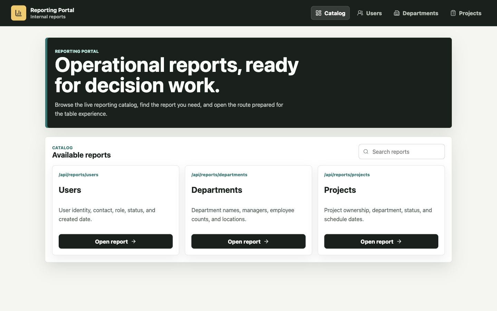
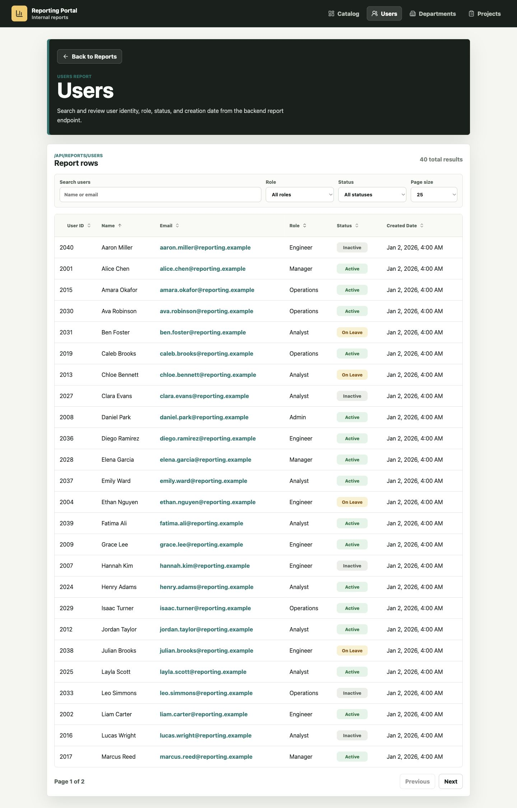
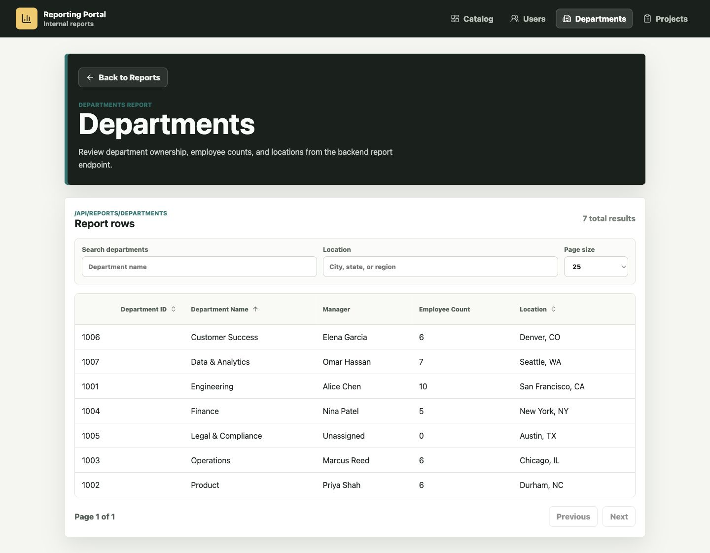
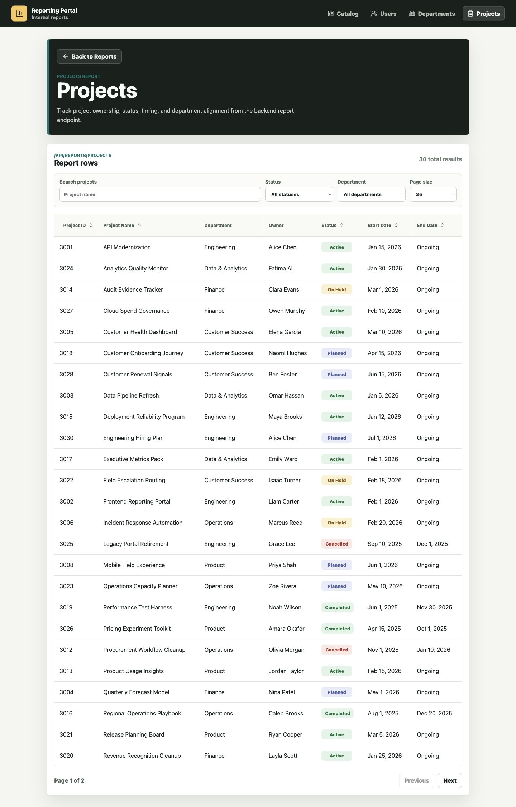
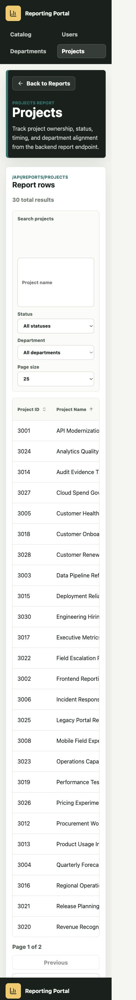

# Reporting Portal

Reporting Portal is a take-home assessment project for browsing operational report data across Users, Departments, and Projects. It includes a React frontend, a Spring Boot REST API, and PostgreSQL persistence with local/demo data managed through Flyway.

The reviewer-facing happy path is:

```bash
docker compose up --build
```

Then open [http://localhost:3000](http://localhost:3000).


## Overview

The application provides:

- A React report catalog landing page.
- Users, Departments, and Projects report screens.
- Search, filters, pagination, and allowlisted sorting.
- A Java/Spring Boot API under `/api`.
- PostgreSQL-backed report data with fictional local demo seed data.
- A single-origin local demo through nginx: frontend routes and `/api` are both served from `localhost:3000`.

## Tech Stack

- Java 21
- Spring Boot
- Spring Data JPA / Hibernate
- PostgreSQL
- Flyway
- Testcontainers
- React
- TypeScript
- Vite
- Docker Compose

## Architecture

The backend uses feature-oriented packages:

- `catalog`
- `users`
- `departments`
- `projects`
- `common`

Each report feature follows a simple layered flow:

```text
Controller -> Service -> Repository -> PostgreSQL
```

Controllers handle HTTP binding and validation. Services coordinate report behavior and map results. Repositories use JPA queries and JPQL projections for report-shaped data. API responses use DTOs such as `ReportMetadata`, `PagedResponse<T>`, and report row DTOs rather than exposing persistence entities.

Flyway owns database schema changes. The local Spring profile also includes repeatable fictional demo seed data.

The frontend uses relative `/api` requests. In local development, Vite proxies those requests to the backend. In the Docker Compose demo, nginx serves the production frontend and proxies `/api` to the backend service, so browser traffic stays on one origin.

Example request flow:

```text
Browser
  -> GET http://localhost:3000/reports/users
  -> React renders Users page
  -> fetch("/api/reports/users?page=0&size=25&sort=name,asc")
  -> nginx proxies to backend:8080
  -> UserReportController -> UserReportService -> UserRepository
  -> PostgreSQL
  -> PagedResponse<UserReportRow>
```

## Running The Application

Prerequisites:

- Docker Desktop or compatible Docker Engine
- Docker Compose v2
- Ports `3000`, `8080`, and `5432` available, unless overridden through environment variables

Start everything from the repository root:

```bash
docker compose up --build
```

Open:

```text
http://localhost:3000
```

Exposed ports:

- Frontend: `http://localhost:3000`
- Backend: `http://localhost:8080`
- PostgreSQL: `localhost:5432`

Reset local database state:

```bash
docker compose down -v
```

Then start again with:

```bash
docker compose up --build
```

## Development

Backend:

```bash
cd backend
./mvnw test
./mvnw spring-boot:run -Dspring-boot.run.profiles=local
```

Frontend:

```bash
cd frontend
npm install
npm test
npm run build
npm run dev
```

During frontend development, Vite proxies browser requests beginning with `/api` to `http://localhost:8080`. The production frontend bundle does not hard-code `localhost:8080`; it uses relative `/api` requests.

## API

Report catalog:

```http
GET /api/reports
```

Users report:

```http
GET /api/reports/users
```

Query parameters:

- `q`
- `role`
- `status`
- `page`
- `size`
- `sort`

Departments report:

```http
GET /api/reports/departments
```

Query parameters:

- `q`
- `location`
- `page`
- `size`
- `sort`

Projects report:

```http
GET /api/reports/projects
```

Query parameters:

- `q`
- `status`
- `departmentId`
- `page`
- `size`
- `sort`

Pagination uses zero-based pages and returns:

- `page`
- `size`
- `totalItems`
- `totalPages`
- `hasNext`
- `hasPrevious`

Sorting is allowlisted per report. Unsupported fields are rejected rather than passed through to persistence queries.

Swagger/OpenAPI is available while the backend is running:

- [http://localhost:8080/swagger-ui.html](http://localhost:8080/swagger-ui.html)
- [http://localhost:8080/v3/api-docs](http://localhost:8080/v3/api-docs)

## Testing

Backend tests include:

- Controller slice tests for routing, validation, and error responses.
- Service and repository tests against real PostgreSQL with Testcontainers.
- Full vertical integration tests for report endpoints.
- Flyway-backed schema validation through PostgreSQL test containers.

Run backend tests:

```bash
cd backend
./mvnw test
```

Frontend tests use Vitest and React Testing Library:

```bash
cd frontend
npm test
```

Frontend production build:

```bash
cd frontend
npm run build
```

## Environment Model

Local:

- PostgreSQL runs through Docker Compose.
- The backend uses the `local` Spring profile.
- Flyway runs schema migrations plus fictional demo seed data.

Tests:

- PostgreSQL is provided by Testcontainers.
- Test data is deterministic and isolated from local/demo data.

Production:

- PostgreSQL is externally configured, such as Neon.
- Connection details come from environment variables.
- Demo seed data is not enabled.
- No real credentials are committed or documented here.

## Assumptions And Tradeoffs

- The report catalog is application metadata, not database data.
- Department `employeeCount` is derived from users rather than stored as a mutable counter.
- JPQL projections are used for report-oriented queries.
- Offset pagination is sufficient for the assessment scope.
- Sorting fields are allowlisted per report.
- Authentication is not implemented because it was outside the assessment scope.
- Demo data is fictional.
- There is no generic reporting framework because only three reports are required.

## Project Structure

```text
reporting-portal/
|-- backend/
|   |-- Dockerfile
|   |-- pom.xml
|   `-- src/
|       |-- main/java/com/chinmaynayak/reporting/
|       |   |-- catalog/
|       |   |-- common/
|       |   |-- departments/
|       |   |-- projects/
|       |   `-- users/
|       `-- main/resources/db/
|           |-- migration/
|           `-- local/
|-- frontend/
|   |-- Dockerfile
|   |-- nginx.conf
|   |-- package.json
|   `-- src/
|       |-- api/
|       |-- app/
|       |-- components/
|       |-- features/
|       `-- styles/
|-- docs/
|   |-- backend-study-guide.md
|   `-- screenshots/
|-- compose.yaml
`-- README.md
```

## Screenshots / Demo

The screenshots below were captured from the local Docker Compose app.

### Landing Page



### Users Report



### Departments Report



### Projects Report



### Responsive / Mobile View


