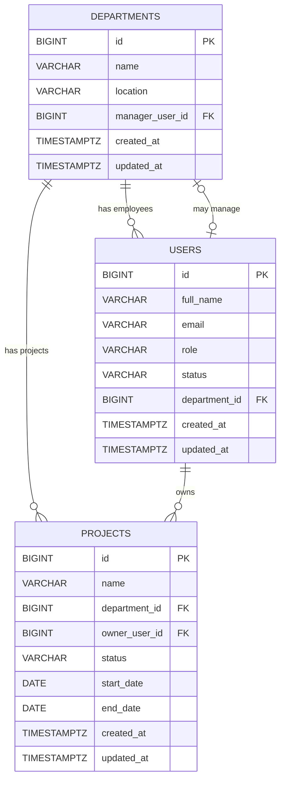

# Reporting Portal Backend — Architecture & Interview Revision Guide

> This README is both project documentation and a revision guide for explaining the backend design during an interview.

## 1. Project Goal

The take-home assessment asks for a small full-stack **reporting portal** with:

- a React frontend,
- a Java backend, with Spring Boot preferred,
- three reports:
  - Users,
  - Departments,
  - Projects,
- REST endpoints for report metadata and report data,
- thoughtful loading, empty, and error states,
- a single-command setup for the full application.

For the backend, this project intentionally goes beyond mock-only data and uses a real PostgreSQL-backed design while keeping the scope understandable and interview-friendly.

---

## 2. Backend Technology Stack

| Technology | Purpose |
|---|---|
| Java 21 | Backend programming language |
| Spring Boot 4.1.x | Application framework and runtime |
| Spring Web | REST controllers and HTTP API |
| Spring Data JPA | Repository abstraction for persistence |
| Hibernate ORM | JPA implementation that maps Java entities to relational tables |
| PostgreSQL | Relational database |
| Neon PostgreSQL | Hosted production-style PostgreSQL |
| Docker Compose PostgreSQL | Local development database |
| Flyway | Version-controlled database schema migrations |
| Testcontainers | Temporary real PostgreSQL database for integration tests |
| Bean Validation | Request/input validation |
| Spring Boot Actuator | Health and operational endpoints |
| Maven Wrapper | Reproducible builds |

### Important architectural principle

Each technology has a different responsibility:

```text
Spring Data JPA
      ↓
JPA API
      ↓
Hibernate ORM
      ↓
JDBC / DataSource
      ↓
PostgreSQL
```

And separately:

```text
Flyway
  ↓
creates / changes the database schema

Testcontainers
  ↓
provides a temporary PostgreSQL database for tests
```

Flyway and Testcontainers are infrastructure tools. They are not part of report business logic.

---

## 3. Repository Structure

The repository is intended to contain both backend and frontend:

```text
reporting-portal/
├── backend/
├── frontend/
├── compose.yaml
├── README.md
└── .gitignore
```

The backend uses **feature-first packaging with layers inside each feature**:

```text
src/main/java/com/chinmaynayak/reporting/
├── ReportingApiApplication.java
│
├── common/
│   ├── config/
│   ├── error/
│   └── web/
│
├── catalog/
│   ├── controller/
│   ├── service/
│   └── dto/
│
├── users/
│   ├── controller/
│   ├── service/
│   ├── repository/
│   ├── domain/
│   └── dto/
│
├── departments/
│   ├── controller/
│   ├── service/
│   ├── repository/
│   ├── domain/
│   └── dto/
│
└── projects/
    ├── controller/
    ├── service/
    ├── repository/
    ├── domain/
    └── dto/
```

### Why feature-first?

A traditional package-by-layer structure looks like:

```text
controller/
service/
repository/
domain/
dto/
```

That is valid, but as the application grows, one feature becomes spread across many top-level packages.

Feature-first packaging keeps everything related to a business capability close together:

```text
users/
departments/
projects/
catalog/
```

This gives the codebase stronger cohesion and makes future growth easier.

### Why still have layers inside features?

Inside a feature, we still want separation of concerns:

```text
HTTP request
    ↓
controller
    ↓
service
    ↓
repository
    ↓
database
```

The controller should not contain database logic, and the repository should not contain HTTP concerns.

---

# 4. What Is a "Report"?

In this project, a report is **not a PDF or Excel export**.

A report is a **read-only structured view of business data**, usually displayed as a table in the frontend.

The three reports are:

```text
Reporting Portal
├── Users Report
├── Departments Report
└── Projects Report
```

Examples:

### Users Report

```text
ID   Name          Email                  Role       Status
-------------------------------------------------------------
1    Alice Chen    alice@example.com      MANAGER    ACTIVE
2    Bob Smith     bob@example.com        ENGINEER   ACTIVE
```

### Departments Report

```text
ID   Department    Manager       Employees   Location
-------------------------------------------------------
10   Engineering   Alice Chen    18          Toronto
20   Finance       Sarah Lee     9           New York
```

### Projects Report

```text
ID    Project            Department    Owner        Status
-----------------------------------------------------------
100   Reporting Portal   Engineering   Alice Chen   ACTIVE
```

The underlying database stores **Users, Departments, and Projects**.

The report endpoints expose a presentation-friendly view of that data.

---

# 5. Required API Endpoints

The assessment requires:

```http
GET /api/reports
GET /api/reports/users
GET /api/reports/departments
GET /api/reports/projects
```

Conceptually:

```text
Database
├── users
├── departments
└── projects
       ↓
Spring Boot API
├── /api/reports/users
├── /api/reports/departments
└── /api/reports/projects
       ↓
React frontend
├── Users table
├── Departments table
└── Projects table
```

`GET /api/reports` is different: it returns metadata describing which reports exist so that the frontend can build the reporting landing page.

---

# 6. Current Database Model

The initial schema contains three tables:

- `departments`
- `users`
- `projects`

## ER Diagram

GitHub renders the following Mermaid diagram:



The diagram is conceptual. The exact manager relationship is enforced with:

```text
departments.manager_user_id → users.id
```

---

# 7. Table Design

## 7.1 `departments`

```text
departments
-----------------------------
id                BIGINT
name              VARCHAR(120)
location          VARCHAR(160)
manager_user_id   BIGINT
created_at        TIMESTAMPTZ
updated_at        TIMESTAMPTZ
```

### Meaning

- `id`: unique database identifier.
- `name`: department name, e.g. Engineering.
- `location`: department location.
- `manager_user_id`: optional reference to a user who manages the department.
- `created_at`: when the record was created.
- `updated_at`: when the record was last changed.

`manager_user_id` is nullable because a department may temporarily have no assigned manager.

---

## 7.2 `users`

```text
users
-----------------------------
id                BIGINT
full_name         VARCHAR(160)
email             VARCHAR(254)
role              VARCHAR(40)
status            VARCHAR(30)
department_id     BIGINT
created_at        TIMESTAMPTZ
updated_at        TIMESTAMPTZ
```

### Meaning

- `id`: unique user ID.
- `full_name`: display name.
- `email`: unique user email.
- `role`: user role.
- `status`: user lifecycle/status.
- `department_id`: department to which the user belongs.
- `created_at`: creation timestamp.
- `updated_at`: last-update timestamp.

The current schema assumes every user belongs to a department.

---

## 7.3 `projects`

```text
projects
-----------------------------
id                BIGINT
name              VARCHAR(160)
department_id     BIGINT
owner_user_id     BIGINT
status            VARCHAR(30)
start_date        DATE
end_date          DATE
created_at        TIMESTAMPTZ
updated_at        TIMESTAMPTZ
```

### Meaning

- `id`: unique project ID.
- `name`: project name.
- `department_id`: department responsible for the project.
- `owner_user_id`: user responsible for the project.
- `status`: project lifecycle status.
- `start_date`: start date.
- `end_date`: optional end date.
- `created_at`: creation timestamp.
- `updated_at`: last-update timestamp.

---

# 8. Database Relationships

## User belongs to Department

```text
users.department_id
        ↓
departments.id
```

Example:

```text
Departments
10 → Engineering

Users
42 → Alice → department_id = 10
```

Meaning:

```text
Alice belongs to Engineering.
```

This is a many-to-one relationship:

```text
Many Users → One Department
```

One department may contain many users.

---

## Project belongs to Department

```text
projects.department_id
        ↓
departments.id
```

Meaning:

```text
Many Projects → One Department
```

One department can have many projects.

---

## Project has an Owner

```text
projects.owner_user_id
        ↓
users.id
```

Meaning:

```text
Many Projects → One User
```

A user may own multiple projects.

---

# 9. The Circular User ↔ Department Relationship

This is one of the most important design details to understand.

There are **two separate business relationships** between User and Department.

## Relationship A — Employee membership

```text
users.department_id → departments.id
```

This means:

> Which department does this user belong to?

Example:

```text
Alice.department_id = Engineering.id
```

## Relationship B — Department manager

```text
departments.manager_user_id → users.id
```

This means:

> Which user manages this department?

Example:

```text
Engineering.manager_user_id = Alice.id
```

Together:

```text
User ── belongs to ──► Department
 ▲                        │
 └────── managed by ──────┘
```

This is called a **circular relationship** because each table contains a foreign key that eventually points to the other table.

It is not an infinite loop and it is not invalid.

The two foreign keys express two different facts.

### Example

```text
Department
id = 10
name = Engineering
manager_user_id = 42

User
id = 42
name = Alice
department_id = 10
```

This means:

1. Alice belongs to Engineering.
2. Engineering is managed by Alice.

---

# 10. Why the Circular Relationship Affects Table Creation

When PostgreSQL creates a foreign key, the referenced table must already exist.

If we create `users` first:

```text
users.department_id → departments.id
```

PostgreSQL cannot create that foreign key because `departments` does not exist yet.

If we create `departments` first with the manager foreign key:

```text
departments.manager_user_id → users.id
```

PostgreSQL cannot create that foreign key because `users` does not exist yet.

Therefore V1 creates them in this order:

```text
1. Create departments
   - manager_user_id column exists
   - manager FK is not added yet

2. Create users
   - users.department_id can now reference departments

3. ALTER departments
   - add manager_user_id foreign key referencing users

4. Create projects
   - both users and departments now exist
```

Conceptually:

```sql
CREATE TABLE departments (...);

CREATE TABLE users (
    department_id BIGINT REFERENCES departments(id)
);

ALTER TABLE departments
    ADD CONSTRAINT ...
    FOREIGN KEY (manager_user_id)
    REFERENCES users(id);

CREATE TABLE projects (...);
```

This is a clean way to solve the creation-order dependency.

---

# 11. Important Business Rule Not Enforced by V1

The current foreign keys ensure that a manager exists, but they do **not** guarantee that the manager belongs to the same department.

This data would technically be valid:

```text
Alice.department_id = Engineering

Finance.manager_user_id = Alice
```

All referenced rows exist, so the foreign keys are satisfied.

If the business requires:

> A department manager must belong to that same department.

that rule can later be enforced in application/service logic.

Because this assessment is read-only, there is currently no manager-assignment write endpoint, so adding a complex database-level enforcement mechanism would be unnecessary.

---

# 12. Why `employee_count` Is Not Stored

The Departments report needs an Employee Count, but there is intentionally no:

```text
departments.employee_count
```

column.

The information already exists in:

```text
users.department_id
```

Example:

```text
Alice → Engineering
Bob   → Engineering
Sarah → Finance
```

Therefore:

```text
Engineering employee count = 2
Finance employee count     = 1
```

PostgreSQL can calculate this:

```sql
SELECT
    department_id,
    COUNT(*)
FROM users
GROUP BY department_id;
```

Storing the count would duplicate state.

If Bob moved departments, we would have to update:

1. Bob's `department_id`
2. the old department's `employee_count`
3. the new department's `employee_count`

That creates an opportunity for inconsistent data.

Deriving the value keeps one source of truth.

---

# 13. Primary Keys

All tables use:

```sql
BIGINT GENERATED BY DEFAULT AS IDENTITY PRIMARY KEY
```

Example:

```text
1
2
3
4
...
```

### Why `BIGINT`?

- simple,
- efficient,
- easy to debug,
- easy to demo,
- more than enough ID space for this application.

### Why `BY DEFAULT AS IDENTITY`?

Normal application inserts can let PostgreSQL generate IDs automatically.

But explicit IDs are still possible if deterministic local/test fixtures are useful later.

Production-grade software does not automatically require UUIDs. IDs should fit the actual system needs.

---

# 14. Foreign Keys

A foreign key protects relationships between tables.

Example:

```sql
FOREIGN KEY (department_id)
REFERENCES departments(id)
```

means:

```text
users.department_id = 10
```

is valid only if department `10` exists.

This prevents orphaned relationships and protects data integrity even if application code contains a bug.

---

# 15. Delete Behavior

The schema deliberately avoids cascading deletion of important business data.

## User → Department

```text
users.department_id
→ departments.id
ON DELETE RESTRICT
```

A department cannot be deleted while users still belong to it.

## Project → Department

```text
projects.department_id
→ departments.id
ON DELETE RESTRICT
```

A department cannot be deleted while projects still reference it.

## Project → Owner

```text
projects.owner_user_id
→ users.id
ON DELETE RESTRICT
```

A user cannot be deleted while they still own projects.

## Department → Manager

```text
departments.manager_user_id
→ users.id
ON DELETE SET NULL
```

If a manager user is deleted, the department remains:

```text
Engineering.manager_user_id = NULL
```

This is sensible because manager assignment is optional.

---

# 16. Constraints

Constraints are rules PostgreSQL enforces directly.

This provides defense in depth: even if Java has a bug, invalid data can still be rejected.

## NOT NULL

Example:

```sql
name VARCHAR(120) NOT NULL
```

The value cannot be absent.

---

## Non-blank checks

`NOT NULL` still allows:

```text
''
'   '
```

Therefore the migration uses checks such as:

```sql
CHECK (length(btrim(name)) > 0)
```

This rejects blank-only names.

These checks are used for important text fields such as:

- department name,
- department location,
- user full name,
- user email,
- project name.

---

## User role constraint

Current allowed values:

```text
ADMIN
MANAGER
ANALYST
ENGINEER
OPERATIONS
```

The assessment does not define these exact role values; they are an implementation assumption representing plausible internal-portal roles.

---

## User status constraint

Current allowed values:

```text
ACTIVE
INACTIVE
ON_LEAVE
```

Again, these are project assumptions because the assessment only requires a Status column.

---

## Project status constraint

Current allowed values:

```text
PLANNED
ACTIVE
ON_HOLD
COMPLETED
CANCELLED
```

---

## Project date constraint

The schema protects against impossible date ranges:

```sql
CHECK (
    end_date IS NULL
    OR end_date >= start_date
)
```

Valid:

```text
start = 2026-08-01
end   = 2026-09-01
```

Valid:

```text
start = 2026-08-01
end   = NULL
```

Invalid:

```text
start = 2026-09-01
end   = 2026-08-01
```

---

## Timestamp consistency

The migration contains checks ensuring:

```text
updated_at >= created_at
```

This prevents an update timestamp from being earlier than the creation timestamp.

---

# 17. `TIMESTAMPTZ` vs `DATE`

Creation/update columns use:

```text
TIMESTAMPTZ
```

because they represent an actual point in time.

Example:

```text
2026-08-11 18:30 Eastern
```

is the same real instant as the corresponding UTC timestamp.

Project `start_date` and `end_date` use:

```text
DATE
```

because they represent calendar dates, not a specific time of day.

---

# 18. Case-Insensitive Uniqueness

## User email

The migration creates:

```sql
CREATE UNIQUE INDEX ux_users_email_lower
ON users (lower(email));
```

Therefore:

```text
alice@example.com
Alice@Example.com
```

cannot exist as two separate users.

## Department name

Similarly:

```sql
CREATE UNIQUE INDEX ux_departments_name_lower
ON departments (lower(name));
```

prevents:

```text
Engineering
engineering
```

from becoming separate departments.

---

# 19. Indexes

An index helps PostgreSQL find or join rows efficiently.

Indexes are not free: they require storage and add work to inserts/updates.

Therefore this project initially indexes only known integrity and relationship needs instead of every possibly filterable column.

Current indexes:

```text
lower(departments.name)       unique
lower(users.email)            unique

departments.manager_user_id
users.department_id
projects.department_id
projects.owner_user_id
```

### Why foreign-key indexes?

The API will frequently join data such as:

```text
Users → Department
Projects → Department
Projects → Owner
Departments → Manager
```

The indexes support those relationships.

### Why not index every status/role immediately?

Columns such as `status` often have few distinct values.

Example:

```text
ACTIVE     80%
INACTIVE   15%
ON_LEAVE    5%
```

An index on a low-selectivity column may not help enough to justify its cost.

Indexes should follow actual query patterns and measured behavior rather than being added speculatively.

---

# 20. What Is a Database Migration?

A **migration** is a versioned change to the structure of the database.

Think of:

```text
Git
→ versions application source code

Flyway
→ versions database structure
```

Example history:

```text
V1__create_reporting_schema.sql
V2__add_project_budget.sql
V3__add_user_last_login.sql
```

Each migration describes how to move the schema forward.

---

# 21. Current Flyway Migration

The current migration is:

```text
src/main/resources/db/migration/
└── V1__create_reporting_schema.sql
```

It creates:

```text
departments
users
projects
foreign keys
check constraints
unique indexes
relationship indexes
```

The migration intentionally does **not** include demo seed data.

Production schema history and local/demo data are different concerns.

---

# 22. Flyway Lifecycle

When Spring Boot starts:

```text
Spring Boot starts
      ↓
DataSource is configured
      ↓
Flyway connects to PostgreSQL
      ↓
Flyway reads migration files
      ↓
Flyway checks flyway_schema_history
      ↓
Missing migrations are executed in order
      ↓
Application startup continues
```

Flyway creates its own metadata table:

```text
flyway_schema_history
```

Conceptually:

```text
version | description                 | success
------------------------------------------------
1       | create reporting schema     | true
```

This tells Flyway which migrations have already been applied.

---

# 23. The Most Important Flyway Rule

Once a migration has been applied to an important/shared environment, treat it as immutable history.

Do **not** edit V1 later just because the schema changes.

Example:

Current:

```text
V1__create_reporting_schema.sql
```

Later a project needs a `budget` column.

Wrong:

```text
edit V1
```

Correct:

```text
V2__add_project_budget.sql
```

Then:

```text
Fresh DB:
V1 → V2 → current schema

Existing DB:
already has V1 → only V2 runs
```

This gives every environment the same reproducible history.

---

# 24. Example: Adding a Column Later

Suppose we want:

```text
projects.budget
```

Create:

```text
V2__add_project_budget.sql
```

Example:

```sql
ALTER TABLE projects
ADD COLUMN budget NUMERIC(14, 2);
```

When Flyway runs against a database already at V1:

```text
Current version: 1
        ↓
V2 exists and has not run
        ↓
Flyway runs V2
        ↓
Current version: 2
```

---

# 25. Does Updating Data Require a Migration?

No.

Normal data changes are not schema migrations.

Example:

```sql
UPDATE users
SET status = 'INACTIVE'
WHERE id = 42;
```

This changes a row, not the table structure.

No migration is needed.

Migrations are for structural changes such as:

```text
add column
remove column
create table
add constraint
create index
change data type
```

---

# 26. Does a New Migration Require an Application Restart?

In the current design, Flyway is integrated with Spring Boot and checks migrations at application startup.

Therefore during local development:

```text
Create V2
   ↓
restart/start Spring Boot
   ↓
Flyway discovers V2
   ↓
V2 is applied
```

Flyway can also be run independently in larger deployment pipelines.

So the general principle is not:

> Database changes require Java restarts.

The real principle is:

> A Flyway process must run to apply the new migration.

In this project, Spring Boot startup is currently what triggers that process.

---

# 27. What Is Testcontainers?

Testcontainers is a testing library that starts temporary Docker containers.

For this backend, automated tests get a real temporary PostgreSQL server.

Without Testcontainers, tests might depend on:

```text
a manually running local database
a shared database
a remote Neon database
or a fake database such as H2
```

Those options are less reliable.

Testcontainers gives every test run its own clean PostgreSQL environment.

---

# 28. Why Use PostgreSQL in Tests Instead of H2?

The production database is PostgreSQL.

H2 is a different database with differences in:

- SQL syntax,
- data types,
- constraints,
- functions,
- date/time behavior,
- indexing,
- PostgreSQL-specific features.

Testing with PostgreSQL reduces the chance of:

```text
Tests pass on H2
Production fails on PostgreSQL
```

The environment strategy is:

```text
Local        → PostgreSQL via Docker Compose
Tests        → PostgreSQL via Testcontainers
Production   → PostgreSQL via Neon
```

All environments use the same database engine.

---

# 29. Testcontainers Lifecycle

When:

```bash
./mvnw test
```

runs, the approximate flow is:

```text
Maven starts tests
       ↓
Testcontainers starts PostgreSQL Docker container
       ↓
@ServiceConnection gives Spring connection details
       ↓
Spring Boot creates DataSource
       ↓
Flyway connects
       ↓
Flyway finds V1
       ↓
V1 creates reporting schema
       ↓
Spring ApplicationContext starts
       ↓
Tests run
       ↓
Temporary PostgreSQL container is destroyed
```

The database starts clean on every run.

---

# 30. What `@ServiceConnection` Does

A PostgreSQL Testcontainer may start with generated runtime connection details such as:

```text
host
random mapped port
database
username
password
```

Spring Boot's `@ServiceConnection` bridges the Testcontainer to Spring configuration.

Conceptually:

```text
Testcontainers
      ↓
knows database connection details
      ↓
@ServiceConnection
      ↓
Spring Boot
      ↓
DataSource
```

This means test code does not need to manually copy generated ports or passwords into properties.

---

# 31. Current Test Proof

The integration smoke test has already demonstrated:

```text
Successfully validated 1 migration
Current version of schema "public": << Empty Schema >>
Migrating schema "public" to version "1 - create reporting schema"
Successfully applied 1 migration to schema "public", now at version v1
```

That proves:

1. Testcontainers started a fresh PostgreSQL instance.
2. Spring connected successfully.
3. Flyway found V1.
4. V1 executed successfully against real PostgreSQL.
5. Spring Boot finished starting.
6. The test passed.

This is stronger than merely testing Java methods.

It verifies the database bootstrap path.

---

# 32. Environment Database Selection

## Local development

```text
Spring Boot
    ↓
application-local.properties
    ↓
Docker Compose PostgreSQL
```

The local database remains running while development work continues.

---

## Automated tests

```text
Spring Boot test
    ↓
@ServiceConnection
    ↓
Testcontainers PostgreSQL
```

The test database is temporary and isolated.

---

## Production

```text
Spring Boot
    ↓
application-prod.properties
    ↓
environment variables
    ↓
Neon PostgreSQL
```

Secrets such as passwords are not committed to Git.

Conceptual production variables:

```text
DB_URL
DB_MIGRATION_URL
DB_USERNAME
DB_PASSWORD
```

A pooled Neon URL can be used for normal application traffic, while a direct connection can be used for migrations.

---

# 33. Flyway vs Hibernate

This distinction is important.

## Flyway

Owns **database structure**.

```text
CREATE TABLE
ALTER TABLE
CREATE INDEX
ADD CONSTRAINT
```

## Hibernate

Maps Java objects to that existing database schema.

Eventually:

```java
@Entity
class UserEntity {
    ...
}
```

maps to:

```text
users
```

The intended production model is:

```text
Flyway
   ↓
creates / changes schema

Hibernate
   ↓
validates mappings and uses schema
```

Not:

```text
Hibernate
   ↓
silently changes production tables
```

---

# 34. `ddl-auto`

During the infrastructure phase:

```properties
spring.jpa.hibernate.ddl-auto=none
```

This means:

> Hibernate must not create or modify database tables.

After JPA entities are mapped correctly, the intended setting is:

```properties
spring.jpa.hibernate.ddl-auto=validate
```

Meaning:

> Hibernate must not change the schema. It should only verify that the entity mappings match the Flyway-created schema.

This creates a useful safety check:

```text
Flyway creates database
       ↓
Hibernate reads Java entity mappings
       ↓
Does Java match the DB?
       ↓
yes → application starts
no  → startup fails
```

---

# 35. Planned JPA Entity Mapping

> The database schema exists now. JPA entity mapping is the next phase and should not be confused with already-completed work.

Planned conceptual mapping:

```text
departments → DepartmentEntity
users       → UserEntity
projects    → ProjectEntity
```

Typical Java/PostgreSQL type mappings:

```text
PostgreSQL    Java
----------------------------
BIGINT        Long
VARCHAR       String
TIMESTAMPTZ   Instant
DATE          LocalDate
```

Enums such as role/status will be mapped using string values rather than numeric ordinal positions.

Intended JPA style:

```java
@Enumerated(EnumType.STRING)
```

Using string enum storage keeps database values readable and avoids corrupting meaning if enum declaration order changes.

---

# 36. Why Entities Should Not Be Returned Directly from REST APIs

A JPA entity models persistence.

An API response models the public frontend contract.

These are different responsibilities.

Bad coupling:

```text
Database entity
      ↓
direct JSON serialization
      ↓
frontend
```

Problems can include:

- lazy-loading issues,
- accidental exposure of internal fields,
- recursive relationships,
- API changes whenever the database changes,
- difficulty evolving persistence independently.

Preferred:

```text
JPA Entity
    ↓
Service
    ↓
Response DTO / Java record
    ↓
JSON
    ↓
React
```

The frontend should depend on a stable API contract, not persistence internals.

---

# 37. Why We Plan to Avoid Unnecessary Bidirectional Collections

The database has:

```text
users.department_id → departments.id
```

That does not automatically mean Java needs:

```java
DepartmentEntity.users
```

Likewise, just because projects belong to departments does not automatically mean:

```java
DepartmentEntity.projects
```

must exist.

Bidirectional entity graphs can increase:

- complexity,
- lazy loading surprises,
- N+1 query risk,
- recursive serialization risk,
- equality/hash-code complexity.

The project should add entity navigation only where a concrete query or business behavior needs it.

---

# 38. `updated_at` Limitation to Remember

The migration defines:

```text
updated_at TIMESTAMPTZ NOT NULL DEFAULT now()
```

The default runs during INSERT.

It does **not** automatically run during UPDATE.

Example:

```sql
UPDATE users
SET full_name = 'Alice Smith'
WHERE id = 42;
```

does not automatically change `updated_at`.

Because the assessment backend is currently read-only, no trigger is needed now.

If write operations are added later, the application or a deliberate database mechanism can maintain `updated_at`.

---

# 39. Current Backend Startup Model

A test startup now looks like:

```text
./mvnw test
      ↓
Testcontainers
      ↓
temporary PostgreSQL
      ↓
@ServiceConnection
      ↓
Spring DataSource
      ↓
Flyway
      ↓
V1 schema migration
      ↓
JPA / Hibernate initialization
      ↓
Spring ApplicationContext
      ↓
test executes
```

Once entity mappings are implemented and `ddl-auto=validate` is enabled:

```text
Flyway creates schema
      ↓
Hibernate validates entities against schema
      ↓
repositories use the schema
```

---

# 40. Future Request Flow

When the backend report endpoints are implemented, a request will look like:

```text
React
  ↓
GET /api/reports/users
  ↓
UserReportController
  ↓
UserReportService
  ↓
UserRepository
  ↓
Spring Data JPA
  ↓
Hibernate
  ↓
DataSource
  ↓
PostgreSQL
  ↓
results
  ↓
Response DTO
  ↓
JSON
  ↓
React table
```

Testcontainers is not part of normal production request handling.

Flyway also does not run for every API request; it is responsible for database schema versioning/bootstrap.

---

# 41. Interview Questions — Quick Answers

## "Why did you use Flyway?"

Because database schema changes should be explicit, version-controlled, reproducible, and reviewable. Flyway allows every environment to reach the same schema state from committed migrations instead of depending on manual database changes or Hibernate auto-update.

---

## "Why not use `hibernate.ddl-auto=update`?"

Automatic schema mutation is convenient for prototypes but makes production changes less explicit and harder to review or reproduce. Flyway owns schema evolution, while Hibernate validates/uses the resulting schema.

---

## "Why did you use Testcontainers?"

To run integration tests against a real PostgreSQL database instead of H2, a shared database, or Neon. Every test gets a clean, isolated PostgreSQL instance, which makes database behavior reproducible and closer to production.

---

## "Why not connect tests directly to Neon?"

That would introduce network dependence, shared state, possible data collisions, slower tests, and risk to development/production data. Testcontainers is disposable and isolated.

---

## "What is the circular relationship?"

Users reference their department:

```text
users.department_id → departments.id
```

Departments optionally reference their manager:

```text
departments.manager_user_id → users.id
```

Those two foreign keys represent different business facts. The circularity affects table creation order, so the manager foreign-key constraint is added after both tables exist.

---

## "Why don't you store employee count?"

Employee count is already represented by how many users reference a department. Storing the count would duplicate data and could become inconsistent. It is safer to derive with `COUNT()`.

---

## "Why `ON DELETE SET NULL` for manager?"

A department should continue to exist if its manager is removed. Since manager assignment is optional, clearing the relationship is more appropriate than deleting or blocking the department.

---

## "Why `ON DELETE RESTRICT` elsewhere?"

Deleting a department with users/projects or deleting a user who still owns projects would leave invalid business relationships. Restricting deletion protects referential integrity.

---

## "Why case-insensitive unique email?"

Emails differing only in capitalization should not create duplicate users. A unique index on `lower(email)` enforces that rule at the database level.

---

## "Why not index every filter column?"

Indexes have costs. The first migration adds indexes justified by known uniqueness and relationship patterns. Additional indexes should be based on actual query patterns and measured performance.

---

## "Why BIGINT IDs instead of UUID?"

The application does not currently need decentralized ID generation or externally opaque identifiers. BIGINT identity keys are simple, efficient, easy to debug, and appropriate for this system.

---

## "What happens when you add a database column?"

Create a new Flyway migration, e.g.:

```text
V2__add_project_budget.sql
```

Do not rewrite already-applied migration history.

---

## "What does Testcontainers prove?"

It proves that the application can start and eventually execute integration behavior against a real PostgreSQL database, including running Flyway migrations from a clean schema.

---

# 42. Current Project Status

Completed:

```text
✓ Spring Boot project initialization
✓ feature-first package structure
✓ PostgreSQL dependencies
✓ Flyway integration
✓ Docker Compose local PostgreSQL
✓ production-style external DB configuration
✓ PostgreSQL Testcontainers
✓ @ServiceConnection test integration
✓ V1 reporting schema migration
✓ foreign keys
✓ check constraints
✓ unique indexes
✓ relationship indexes
✓ migration verified against fresh PostgreSQL
```

Not yet implemented:

```text
□ JPA entity mappings
□ Hibernate schema validation
□ repositories
□ report services
□ controllers
□ pagination
□ filtering
□ sorting
□ standardized API errors
□ OpenAPI
□ report integration tests
□ frontend
```

---

# 43. Recommended Next Phase

Next: **JPA entity mapping**

Map:

```text
departments → DepartmentEntity
users       → UserEntity
projects    → ProjectEntity
```

Understand before implementation:

- `@Entity`
- `@Table`
- `@Id`
- `@GeneratedValue`
- `@Column`
- `@ManyToOne`
- `@JoinColumn`
- `FetchType.LAZY`
- `@Enumerated(EnumType.STRING)`
- JPA no-argument constructor
- entity vs DTO
- unidirectional vs bidirectional relationships
- Hibernate schema validation

After the mappings are correct:

```properties
spring.jpa.hibernate.ddl-auto=validate
```

can be enabled so startup proves the Java persistence model matches the Flyway-managed PostgreSQL schema.

---

# 44. Mental Model to Memorize

If you remember only one diagram, remember this:

```text
                    REPORTING PORTAL
                           │
                    Spring Boot API
                           │
              Spring Data JPA Repositories
                           │
                       Hibernate
                           │
                       DataSource
                           │
                       PostgreSQL
                           │
             ┌─────────────┴─────────────┐
             │                           │
          Flyway                    Application
   schema versioning               reads report data
             │
      migrations V1, V2...

Testing adds:

        Testcontainers
             │
   temporary PostgreSQL
             │
       Flyway runs V1
             │
   integration tests execute
             │
      database discarded
```

Short version:

```text
Flyway         = database schema history
Testcontainers = temporary real PostgreSQL for tests
Hibernate      = Java ↔ relational mapping
Spring Data JPA= repository convenience layer
PostgreSQL     = source of persisted business data
```

---

# 45. Glossary

**Schema**  
The structure of the database: tables, columns, constraints, indexes, relationships.

**Migration**  
A versioned database schema change.

**Primary Key**  
The unique identifier of a row.

**Foreign Key**  
A rule linking a value in one table to an existing row in another table.

**Constraint**  
A database-enforced rule protecting valid data.

**Index**  
A database structure that improves certain lookups or joins, at a storage/write cost.

**Entity**  
A Java persistence object mapped by JPA/Hibernate to a database table.

**DTO**  
Data Transfer Object. A purpose-built shape used to move data across boundaries such as an HTTP API.

**JPA**  
Jakarta Persistence API, the Java persistence specification.

**Hibernate**  
The JPA implementation used to map Java objects to relational data.

**Spring Data JPA**  
Spring abstraction that simplifies repository implementation on top of JPA.

**Flyway**  
Tool for versioning and applying database schema changes.

**Testcontainers**  
Library for running disposable Docker services, such as PostgreSQL, during tests.

**DataSource**  
Spring/Java's configured access point for obtaining database connections.

**Referential Integrity**  
Guarantee that relationships between tables remain valid.

**Cardinality**  
The number relationship between records, e.g. one Department to many Users.

---

## Final Interview Principle

The goal of the backend is not to use the largest possible technology stack.

The goal is to make each engineering choice explainable:

```text
Why PostgreSQL?
Why Flyway?
Why Testcontainers?
Why these foreign keys?
Why these constraints?
Why derive employee count?
Why not expose entities?
Why feature-first packages?
```

A small system with clear boundaries, reproducible schema management, realistic integration testing, and decisions you can defend is stronger than a larger system containing technologies you cannot explain.
